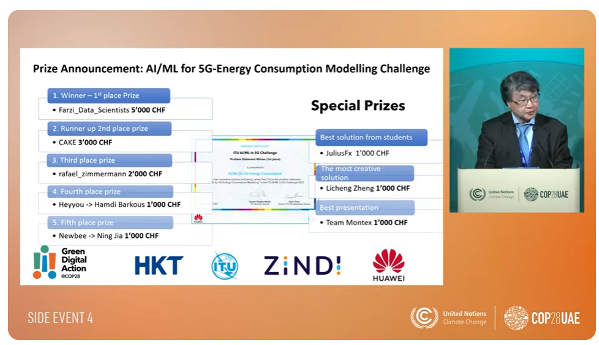

# AI/ML for 5G-Energy Consumption Modelling  

This work was rated as the **best solution from students** in the 28th United Nations Climate Change Conference(Conference of the Parties of the UNFCCC, more commonly referred to as COP28), held from 30 November until 12 December 2023 at Expo City, 

Dubai 

Watch full event here: https://www.youtube.com/watch?v=SDVRa1KYqic&list=PLBcZ22cUY9RLMkm-apVgzZ8JSi0Tsywd3&index=23

